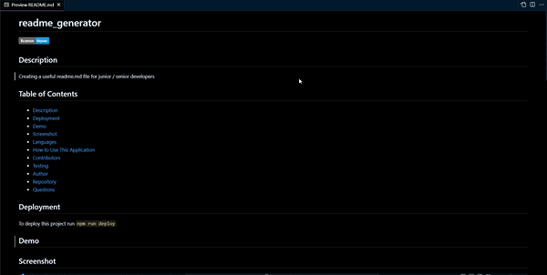
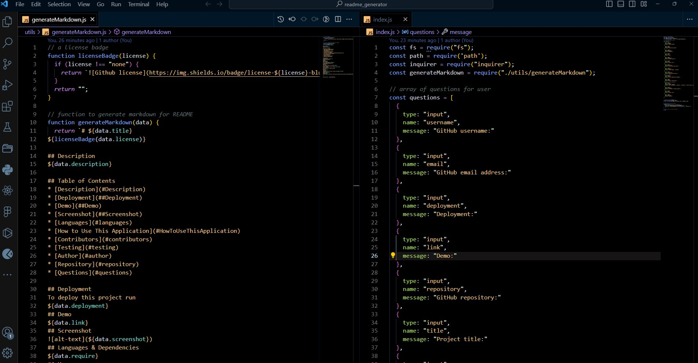

# readme_generator


## Description
The readme.md file generator is a user friendy duide to generate easily peofessional documents fr GitHub. The project has clear instructions for setup, usage, contributionsand other required and optional sections for a professional lookimg readme file. It isdesigned to ensure everyone can easily understand and using project functionalities.

## Table of Contents
* [Description](description)
* [Deployment](#deployment)
* [Demo](#demo)
* [Screenshot](#screenshot)
* [Languages](#languages)
* [Usage](#usage)
* [Contributors](#contributors)
* [Testing](#testing)
* [Author](#author)
* [Repository](#repository)
* [Questions](#questions)

## Deployment
To deploy this project run
``` npm run deploy ```
## Demo
https://www.youtube.com/watch?v=uUla1IiF3gM
## Screenshot
<p>Output of the project in gif format</p>

 
<br>
<p>Output of the project in image format</p>
<br>


## Languages
Javascript, NodeJs
## Usage
This project can be used The project allows that to create a readme.md file as professionally as well as not spending long time for projects.
## Installation
Install readme_generator with this project locally, firstly clone the repository to your local machine and install npm   ``` npm install ```
## Contributors
Contributions are always welcome!
## Tests
``` npm run test ```
## Author
[@tigerkaplan](https://github.com/tigerkaplan)
## Repository
https://github.com/tigerkaplan/readme_generator
## Questions
Please send your questions [here](mailto:husniyeerparun@gmail.com?subject=[GitHub]%20Dev%20Connect) or visit [github/tigerkaplan](https://github.com/tigerkaplan) for my other projects on GitHub.
